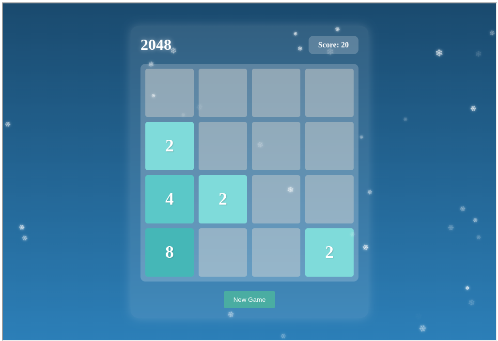

Here's a beautiful README for your 2048 game project:

# 🎮 2048 Game with Snowfall Effect

A beautiful implementation of the classic 2048 game with a unique winter theme and falling snowflakes animation. Built with vanilla JavaScript and styled with modern CSS.



## ✨ Features

- 🎯 Classic 2048 gameplay mechanics
- ❄️ Beautiful snowfall animation
- 🎨 Modern gradient background
- 💫 Smooth animations and transitions
- 🏆 Score tracking
- 🔄 Restart game functionality
- 📱 Responsive design
- 🌟 Glass-morphism UI effects

## 🚀 Quick Start

### Using Docker (Recommended)

1. Clone the repository:
```bash
git clone https://github.com/yourusername/2048-game.git
cd 2048-game
```

2. Build and run with Docker Compose:
```bash
docker-compose up --build
```

3. Open your browser and navigate to `http://localhost:8080`

### Manual Setup

1. Clone the repository
2. Open `src/index.html` in your browser

## 🎮 How to Play

- Use arrow keys to move tiles
- When two tiles with the same number touch, they merge into one
- Create a tile with the number 2048 to win
- If you can't make a move, the game is over

## 🛠️ Technical Stack

- HTML5
- CSS3 (with modern features like Grid, Flexbox, and CSS animations)
- Vanilla JavaScript (ES6+)
- Docker for containerization
- Nginx as web server

## 🏗️ Project Structure

```
2048-game/
├── src/
│ ├── index.html # Main HTML file
│ ├── style.css # Styles and animations
│ └── app.js # Game logic and snowfall effect
├── Dockerfile # Nginx container configuration
├── docker-compose.yml
└── .dockerignore
```

## 🎨 Color Scheme

The game features a beautiful color palette:
- Background: Linear gradient from `#1a4a6e` to `#2c7fb8`
- Tiles: Various shades of teal and blue
- Text: White with subtle shadows
- UI Elements: Semi-transparent white with blur effects

## 🤝 Contributing

Contributions are welcome! Please feel free to submit a Pull Request.

## 📝 License

This project is licensed under the MIT License - see the LICENSE file for details.

## 🙏 Acknowledgments

- Inspired by the original 2048 game by Gabriele Cirulli
- Snowfall animation inspired by various winter-themed web designs
